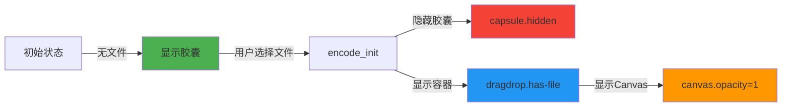

# Bm 模式胶囊变形问题 - 最终解决方案

**日期**: 2024-12-12  
**状态**: ✅ 推荐方案（用户建议）

---

## 🎯 用户推荐方案：分离胶囊和容器

### 核心思想

将胶囊样式作为独立的 div，与 dragdrop 容器完全分离：

- **胶囊层**: 无文件时显示，提供视觉提示
- **Canvas 容器**: 默认透明，有文件时显示毛玻璃效果

---

## 📐 设计方案

### HTML 结构改动

```html
<!-- 胶囊提示层（无文件时显示） -->
<div id="capsule-placeholder" class="capsule-placeholder">
  【 Tap to start 】
</div>

<!-- Canvas 容器（默认透明，有文件时显示毛玻璃效果） -->
<div id="dragdrop" class="dragdrop" title="Drag and drop a file">
  <canvas id="canvas" class="canvas"></canvas>
</div>
```

### CSS 样式改动

```css
/* ========== 胶囊提示层 ========== */
#capsule-placeholder {
  background-color: rgba(255, 255, 255, 0.1);
  backdrop-filter: blur(10px);
  border: 1px solid rgba(255, 255, 255, 0.2);
  margin: 15px;
  margin-top: 120px;
  margin-left: 0px;
  margin-right: 15px;
  color: #F0F0F0;
  border-radius: 40px;
  padding: 12px;
  height: 80px;
  box-sizing: border-box;
  display: flex;
  align-items: center;
  justify-content: center;
  font-size: 1.5em;
  text-align: center;
  white-space: nowrap;
  position: relative;
}

/* 有文件时隐藏胶囊 */
#capsule-placeholder.hidden {
  display: none;
}

/* ========== Canvas 容器 ========== */
/* 默认透明，不显示任何样式 */
#dragdrop {
  margin: 15px;
  margin-top: 15px;
  margin-left: 0px;
  margin-right: 15px;
  border-radius: 25px;
  padding: 12px;
  height: calc(100vh - 30px);
  box-sizing: border-box;
  display: flex;
  align-items: center;
  justify-content: center;
  position: relative;
  /* 默认完全透明 */
  background-color: transparent;
  border: none;
  backdrop-filter: none;
}

/* 有文件时显示毛玻璃效果 */
#dragdrop.has-file {
  background-color: rgba(255, 255, 255, 0.1);
  backdrop-filter: blur(10px);
  border: 1px solid rgba(255, 255, 255, 0.2);
}

/* Canvas 默认隐藏 */
#canvas {
  display: block;
  position: relative;
  opacity: 0;
  pointer-events: none;
}

/* 有文件时显示 Canvas */
#dragdrop.has-file #canvas {
  opacity: 1;
  pointer-events: auto;
}
```

### JavaScript 改动

修改 [`encode_init()`](web/pack/v3/main_v2.js:151) 函数：

```javascript
encode_init: function (filename) {
  console.log("encoding " + filename);
  const wasmFn = copyToWasmHeap(new TextEncoder("utf-8").encode(filename));
  try {
    var res = Module._cimbare_init_encode(wasmFn.byteOffset, wasmFn.length, -1);
    console.log("init_encode returned " + res);
  } finally {
    Module._free(wasmFn.byteOffset);
  }

  // 隐藏胶囊，显示 Canvas 容器
  document.getElementById('capsule-placeholder').classList.add('hidden');
  document.getElementById('dragdrop').classList.add('has-file');

  Main.setTitle(filename);
  Main.setHTML("current-file", filename);
}
```

---

## ✅ 方案优点

### 1. 完全分离
- 胶囊和容器是两个独立的 DOM 元素
- 互不干扰，各自管理自己的样式和状态

### 2. 逻辑清晰
```
无文件状态：
  - capsule-placeholder: 显示（胶囊样式）
  - dragdrop: 透明（不可见）
  - canvas: 隐藏

有文件状态：
  - capsule-placeholder: 隐藏
  - dragdrop: 毛玻璃效果（可见）
  - canvas: 显示
```

### 3. 避免副作用
- Canvas 的 `resize()` 和 `scaleCanvas()` 不会影响胶囊
- 模式切换（B/Bm/4C）不会触发胶囊变化
- 宽高比变化只影响 Canvas，不影响胶囊

### 4. 易于维护
- 两个独立元素，职责单一
- CSS 样式清晰，不需要复杂的条件判断
- JavaScript 逻辑简单，只需切换 class

### 5. 性能优化
- 无文件时 dragdrop 完全透明，不占用渲染资源
- 不需要 `::before` 伪元素，减少 CSS 复杂度
- 使用 `display: none` 完全移除胶囊，节省内存

---

## 🔄 状态转换流程



---

## 📋 实施步骤

### 步骤 1: 修改 HTML 结构

在 [`index_v2.html`](web/pack/v3/index_v2.html) 中：

1. 在导航栏后添加胶囊层
2. 修改 dragdrop 容器（移除 `::before` 伪元素相关样式）

### 步骤 2: 修改 CSS 样式

1. 添加 `#capsule-placeholder` 样式
2. 修改 `#dragdrop` 默认样式为透明
3. 添加 `#dragdrop.has-file` 样式
4. 添加 Canvas 显示/隐藏逻辑
5. 删除 `.dragdrop::before` 相关样式

### 步骤 3: 修改 JavaScript

在 [`main_v2.js`](web/pack/v3/main_v2.js) 的 `encode_init()` 中：

1. 添加隐藏胶囊的代码
2. 保持添加 `has-file` 类的代码

### 步骤 4: 测试验证

1. ✅ 无文件时显示胶囊
2. ✅ 点击 B/Bm/4C 模式，胶囊保持不变
3. ✅ 选择文件后，胶囊消失，容器显示
4. ✅ 有文件后切换模式，容器正常工作
5. ✅ Canvas 正常显示和缩放

---

## 🎨 视觉效果对比

### 之前的实现（有问题）

```
无文件状态：
┌─────────────────────────────────┐
│  dragdrop (毛玻璃胶囊)           │
│  ┌───────────────────────────┐  │
│  │ ::before "Tap to start"   │  │
│  │ Canvas (隐藏但存在)        │  │
│  └───────────────────────────┘  │
└─────────────────────────────────┘
问题：Canvas resize 会影响容器
```

### 新的实现（推荐）

```
无文件状态：
┌─────────────────────────────────┐
│  capsule-placeholder (胶囊)     │
│  "【 Tap to start 】"           │
└─────────────────────────────────┘

┌─────────────────────────────────┐
│  dragdrop (透明，不可见)         │
│  Canvas (隐藏)                  │
└─────────────────────────────────┘

有文件状态：
capsule-placeholder (隐藏)

┌─────────────────────────────────┐
│  dragdrop (毛玻璃容器)           │
│  ┌───────────────────────────┐  │
│  │ Canvas (显示)             │  │
│  └───────────────────────────┘  │
└─────────────────────────────────┘
优点：完全独立，互不影响
```

---

## 🔧 代码对比

### 旧代码（使用 ::before）

```css
#dragdrop {
  /* 胶囊样式 */
  height: 80px;
  margin-top: 120px;
  border-radius: 40px;
  background-color: rgba(255, 255, 255, 0.1);
  /* ... */
}

#dragdrop.has-file {
  /* 展开样式 */
  height: calc(100vh - 30px);
  margin-top: 15px;
  /* ... */
}

.dragdrop::before {
  content: "【 Tap to start 】";
  /* ... */
}

#dragdrop.has-file::before {
  display: none;
}
```

**问题**: dragdrop 既是胶囊又是容器，职责混乱

### 新代码（分离元素）

```css
/* 胶囊 - 独立元素 */
#capsule-placeholder {
  height: 80px;
  margin-top: 120px;
  border-radius: 40px;
  background-color: rgba(255, 255, 255, 0.1);
  /* ... */
}

#capsule-placeholder.hidden {
  display: none;
}

/* 容器 - 独立元素 */
#dragdrop {
  height: calc(100vh - 30px);
  margin-top: 15px;
  border-radius: 25px;
  background-color: transparent; /* 默认透明 */
  /* ... */
}

#dragdrop.has-file {
  background-color: rgba(255, 255, 255, 0.1);
  backdrop-filter: blur(10px);
  /* ... */
}
```

**优点**: 职责单一，逻辑清晰

---

## 📊 技术细节

### 为什么这个方案能解决问题？

1. **胶囊独立存在**
   - 不受 Canvas 尺寸影响
   - 不受模式切换影响
   - 不受 resize() 函数影响

2. **容器默认透明**
   - 无文件时完全不可见
   - 不会因为 Canvas resize 而显示出来
   - 只有添加 `.has-file` 类后才显示

3. **Canvas 独立控制**
   - 可以自由 resize 和 scale
   - 不影响胶囊的显示
   - 只在有文件时才可见

### 关键技术点

```css
/* 1. 使用 display: none 完全移除元素 */
#capsule-placeholder.hidden {
  display: none;  /* 不占用空间，不参与渲染 */
}

/* 2. 使用 opacity 控制 Canvas 可见性 */
#canvas {
  opacity: 0;  /* 不可见但占用空间 */
  pointer-events: none;  /* 不响应鼠标事件 */
}

#dragdrop.has-file #canvas {
  opacity: 1;
  pointer-events: auto;
}

/* 3. 默认透明容器 */
#dragdrop {
  background-color: transparent;
  border: none;
  backdrop-filter: none;
}
```

---

## 🎓 设计原则

### 单一职责原则（SRP）

- **胶囊**: 只负责显示提示信息
- **容器**: 只负责包裹 Canvas
- **Canvas**: 只负责显示编码内容

### 开闭原则（OCP）

- 对扩展开放：可以轻松添加新的状态或样式
- 对修改封闭：不需要修改现有的 resize 逻辑

### 依赖倒置原则（DIP）

- 高层模块（UI 显示）不依赖低层模块（Canvas 渲染）
- 两者通过抽象（CSS 类）进行交互

---

## ✨ 总结

这个方案通过**分离关注点**，将胶囊和容器完全独立，从根本上解决了 Bm 模式导致胶囊变形的问题。

**核心优势**:
1. ✅ 简单直观
2. ✅ 易于理解
3. ✅ 易于维护
4. ✅ 性能优秀
5. ✅ 完全解决问题

---

**文档创建时间**: 2024-12-12  
**状态**: ✅ 推荐实施