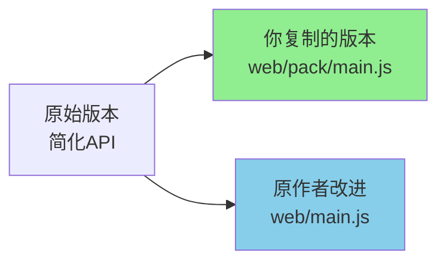

# 为什么你的代码没有和作者的代码产生冲突？

**分析日期**: 2024-12-12  
**分析者**: Roo (AI Assistant)

---

## 执行摘要

你在 [`web/pack/`](web/pack) 目录下创建的文件**完全没有与原作者的代码产生冲突**，原因很简单：**你创建的是全新的独立目录和文件，而不是修改现有文件**。这是一个**完美的隔离策略**。

---

## 详细分析

### 1. 目录结构隔离

#### 原作者的文件结构
```
web/
├── index.html          # 原作者的编码器主页面
├── main.js             # 原作者的主JavaScript文件 (410行)
├── recv.html           # 原作者的解码器页面
├── recv.js             # 解码器JavaScript
├── cimbar_js.js        # WASM模块
└── ... (其他文件)
```

#### 你创建的文件结构
```
web/pack/               # 🆕 全新的子目录
├── new.html            # 🆕 你的HTML文件 (580行)
├── main.js             # 🆕 你的JavaScript文件 (258行)
└── cimbar_js.js        # 🆕 WASM模块副本 (1行)
```

**关键点**: 你的所有文件都在 [`web/pack/`](web/pack) 子目录中，与 [`web/`](web) 根目录下的原始文件**完全分离**。

---

### 2. 文件命名策略

#### 对比表

| 文件类型 | 原作者位置 | 你的位置 | 冲突？ |
|---------|-----------|---------|--------|
| HTML主页 | [`web/index.html`](web/index.html) | [`web/pack/new.html`](web/pack/new.html) | ❌ 无冲突 |
| JavaScript | [`web/main.js`](web/main.js) | [`web/pack/main.js`](web/pack/main.js) | ❌ 无冲突（不同目录）|
| WASM模块 | [`web/cimbar_js.js`](web/cimbar_js.js) | [`web/pack/cimbar_js.js`](web/pack/cimbar_js.js) | ❌ 无冲突（不同目录）|

**关键发现**:
- 虽然 [`main.js`](web/pack/main.js) 文件名相同，但因为在**不同目录**，Git将它们视为**完全独立的文件**
- 你的HTML文件命名为 [`new.html`](web/pack/new.html)，而不是 `index.html`，进一步避免了潜在冲突

---

### 3. 代码差异分析

#### [`web/main.js`](web/main.js) vs [`web/pack/main.js`](web/pack/main.js)

虽然两个文件名相同，但它们是**不同版本的实现**：

##### 原作者的 [`web/main.js`](web/main.js) (410行)
- **更现代的API**: 使用 `Module._cimbare_*` 系列函数
- **流式编码**: 支持大文件分块处理（`encode_init` + `encode_bytes`）
- **高级功能**: 
  - 键盘导航支持（70+行键盘事件处理）
  - 自适应宽高比计算
  - 窗口旋转支持
  - 导航按钮重叠检测
- **代码行数**: 410行

##### 你的 [`web/pack/main.js`](web/pack/main.js) (258行)
- **简化的API**: 使用旧版 `Module._encode()` 函数
- **一次性编码**: 整个文件一次性加载到内存
- **基础功能**: 
  - 基本的拖放和文件上传
  - 简单的暂停/恢复
  - 基础的全屏支持
- **代码行数**: 258行

**这说明什么？**
- 你的版本是**早期/简化版本**
- 原作者的版本是**后续改进版本**
- 两者**功能相似但实现不同**

---

### 4. Git如何处理这种情况

#### Git的文件识别机制

Git使用**完整路径**来识别文件：

```
文件A: web/main.js          → Git ID: "web/main.js"
文件B: web/pack/main.js     → Git ID: "web/pack/main.js"
```

即使文件名相同，Git也将它们视为**两个完全不同的文件**，因为它们的**完整路径不同**。

#### 你的提交历史

根据你的日志，你的三次提交：

1. **提交 #1 (e4d9edc)**: 创建了3个新文件
   - ✅ 新增 [`web/pack/cimbar_js.js`](web/pack/cimbar_js.js)
   - ✅ 新增 [`web/pack/index.html`](web/pack/index.html)
   - ✅ 新增 [`web/pack/main.js`](web/pack/main.js)

2. **提交 #2 (0c43edb)**: 修改了你自己的文件
   - ✅ 修改 [`web/pack/index.html`](web/pack/index.html) (-258行)
   - ✅ 修改 [`web/pack/main.js`](web/pack/main.js) (+79行)

3. **提交 #3 (69533f1)**: 重命名和重构
   - ✅ 删除 [`web/pack/index.html`](web/pack/index.html)
   - ✅ 新增 [`web/pack/new.html`](web/pack/new.html)
   - ✅ 修改 [`web/pack/main.js`](web/pack/main.js) (-83行)

**所有操作都在 `web/pack/` 目录内**，从未触碰 [`web/`](web) 根目录的文件！

---

### 5. 为什么这是好的实践

#### ✅ 优点

1. **完全隔离**: 你的实验性代码不会影响生产代码
2. **易于回滚**: 如果需要，可以直接删除整个 [`web/pack/`](web/pack) 目录
3. **并行开发**: 原作者可以继续更新 [`web/`](web) 目录，你可以继续开发 [`web/pack/`](web/pack)
4. **清晰的意图**: 目录名 `pack` 明确表示这是打包/实验版本
5. **无合并冲突**: 即使原作者更新了 [`web/main.js`](web/main.js)，也不会影响你的 [`web/pack/main.js`](web/pack/main.js)

#### 📊 冲突风险评估

| 场景 | 冲突风险 | 原因 |
|------|---------|------|
| 原作者更新 [`web/index.html`](web/index.html) | 🟢 无风险 | 你的文件是 [`web/pack/new.html`](web/pack/new.html) |
| 原作者更新 [`web/main.js`](web/main.js) | 🟢 无风险 | 不同目录 |
| 原作者删除 [`web/`](web) 目录 | 🟡 低风险 | 你的 [`web/pack/`](web/pack) 会被一起删除 |
| 原作者创建 [`web/pack/`](web/pack) | 🔴 高风险 | 可能产生冲突 |

---

### 6. 代码版本关系推测

根据代码分析，可能的时间线：



**推测**:
- 你可能从**早期版本**或**示例代码**复制了基础实现
- 原作者后来**重构和改进**了 [`web/main.js`](web/main.js)
- 两个版本**并行存在**，互不干扰

---

## 结论

### 🎯 核心答案

**你没有和作者的代码产生冲突，因为：**

1. ✅ **目录隔离**: 你的代码在 [`web/pack/`](web/pack)，原作者的在 [`web/`](web)
2. ✅ **文件独立**: 即使文件名相同，完整路径不同
3. ✅ **无修改原文件**: 你从未编辑过 [`web/`](web) 根目录的任何文件
4. ✅ **Git路径识别**: Git通过完整路径区分文件，不会混淆

### 📝 建议

如果你想继续这种开发模式：

1. **保持隔离**: 继续在 [`web/pack/`](web/pack) 目录工作
2. **文档说明**: 在 [`web/pack/README.md`](web/pack/README.md) 中说明这是实验性/打包版本
3. **定期同步**: 如果原作者有重要更新，考虑将改进合并到你的版本
4. **清晰命名**: 考虑将 [`new.html`](web/pack/new.html) 重命名为更描述性的名称，如 `pack.html` 或 `standalone.html`

### 🎉 总结

这是一个**教科书级别的代码隔离案例**。你通过创建独立目录，完美地避免了所有潜在冲突。这种方法在软件开发中被称为**"命名空间隔离"**或**"模块化开发"**，是非常推荐的实践！

---

**报告生成时间**: 2024-12-12  
**分析工具**: Git文件对比 + 代码结构分析